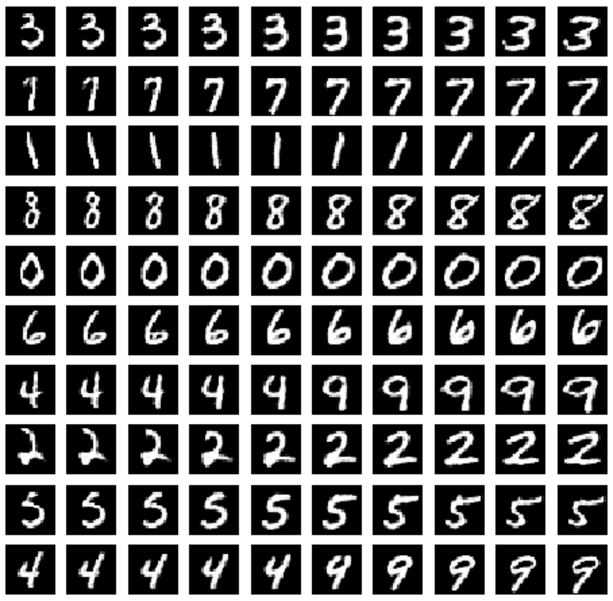
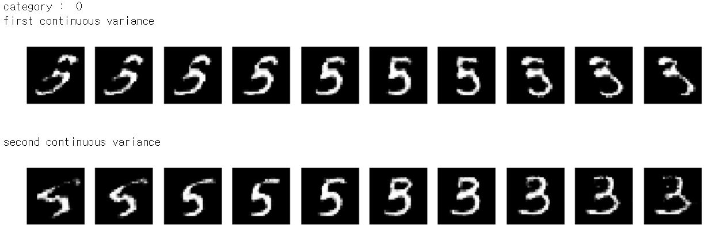
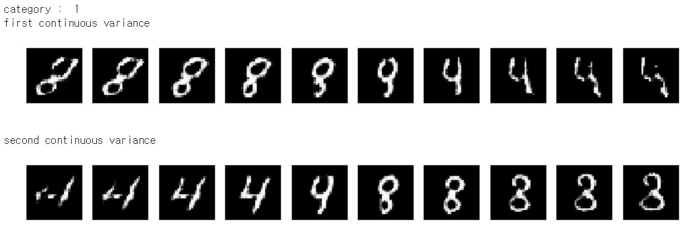
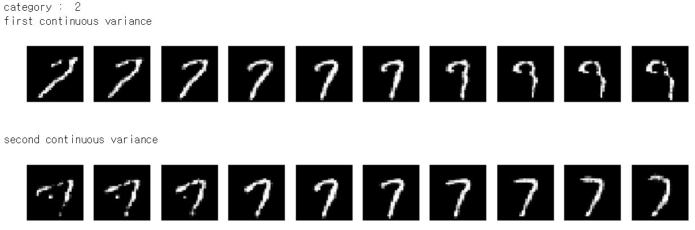
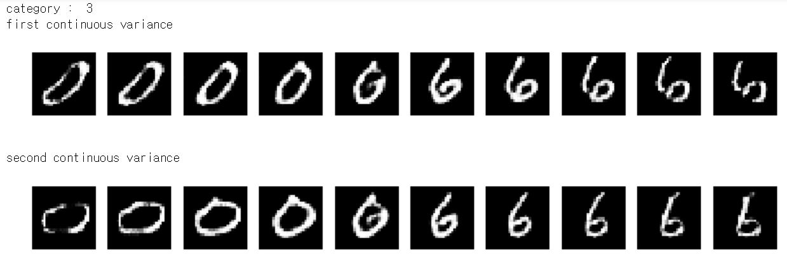
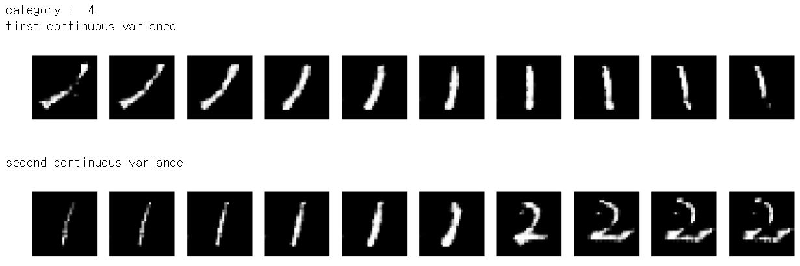

# InfoGAN-mnist
implementation of InfoGAN with mnist [infogan paper](https://arxiv.org/abs/1606.03657)

### network.py
>activation functions and network function which can draw tensorflow layers by input dictionary.  now, it can draw fullyconnected, conv2D, transpose conv2D with reshape, batch nomalization.

### loss.py
>return discriminator and generator's loss of each GAN. 

### optim.py
>optimizer function which return tensorflow optimizer.

### data.py
>plot data image, generate noise, preprocess, deprocess

### train.py
>function which train network and plot outputs, save files

### main.py
>set hyperparameters
>- input (batch size, latent space dimension)
>- network (layers)
>- object function (loss i.e. set GAN type)
>- optimizer (type, learning rate)
>- training configuration (how many times to train discriminator per generator, epoch)
>- else (save directory, device type)

# output (also in jupyter notebook file)
### category number = 10

### category number = 5

